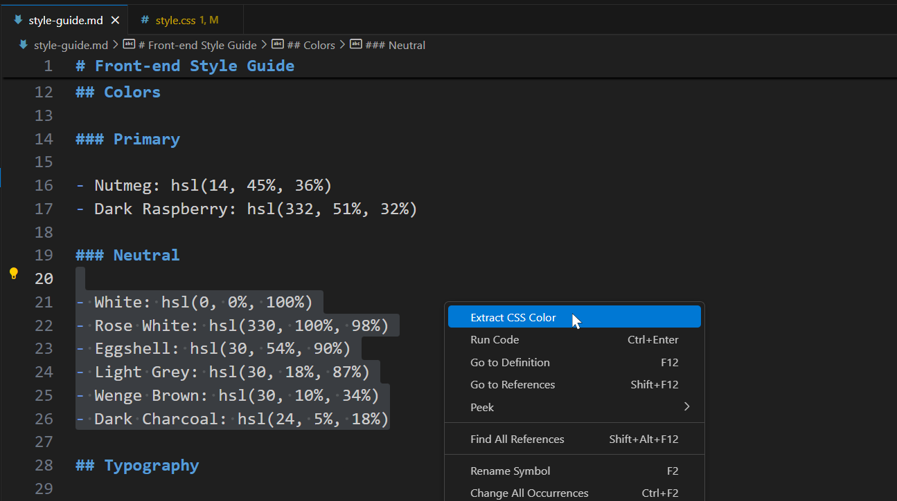
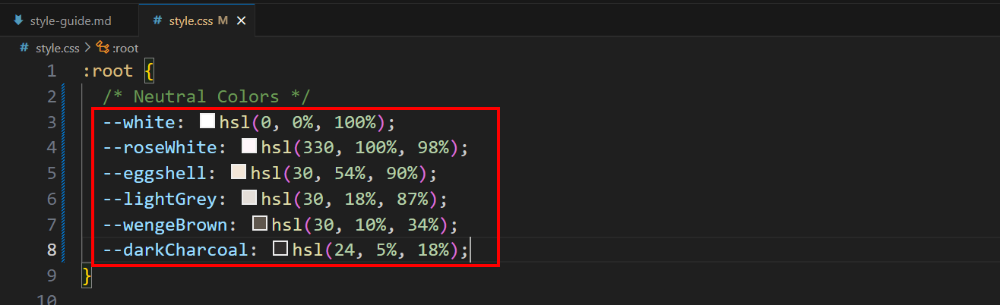

# Frontend Mentor Color Variables Helper

## Overview

A simple VS Code extension to extract colors from Frontend Mentor style guides and convert them into CSS variables. Ideal for Frontend Mentor users to streamline color extraction and variable creation for design challenges.

## Features

- Extract colors from style guides
- Convert colors to CSS variables
- Easy to use with no complex setup

## How to Use

1. Select the colors provided in the **style-guide.md** file and right-click.
2. Choose the "Extract CSS Color" option from the context menu.
   
3. Paste the result into your **style.css** file.
   

## Tip: Extract All Colors at Once

You can quickly extract all the colors from the entire `style-guide.md` file by selecting all the text at once. Simply press:

- **`Ctrl + A`** on Windows
- **⌘ + A** on Mac

Then run the extension to extract and copy all the colors in the page in one go!

## Installation

### From the VS Code Marketplace

1. Search for **Frontend Mentor Color Variables Helper** in the [VS Code Marketplace](https://marketplace.visualstudio.com/).
2. Click **Install**.

### From GitHub

1. Clone this repository:
   ```bash
   git clone https://github.com/ali-ahmed8/frontend-mentor-color-extractor.git
   ```
